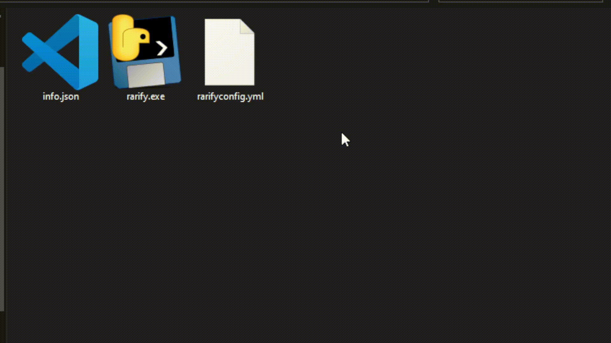
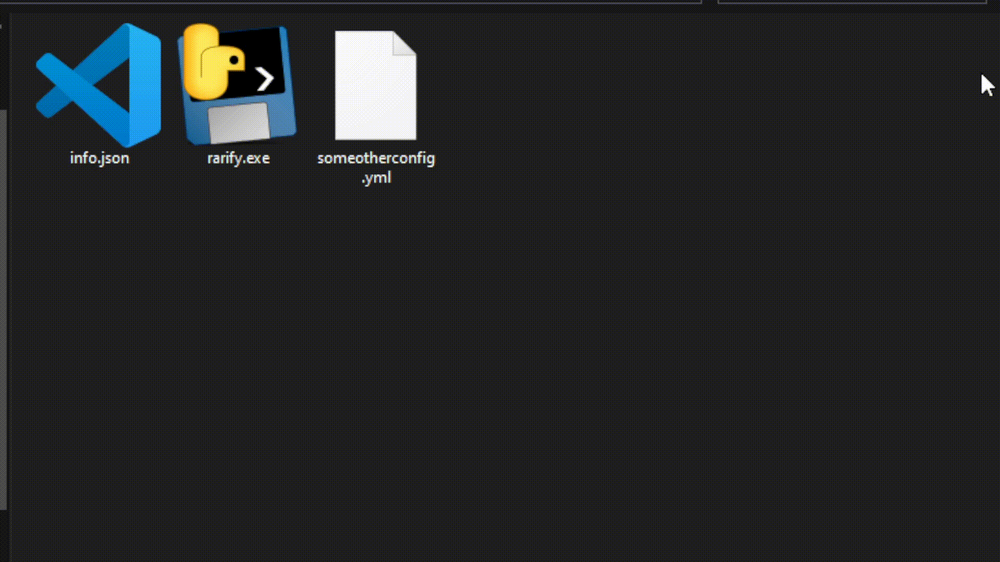

# OpenFusionRarify

Have you ever banged your head against the drop system? Have you ever just wanted to point at your drops and XDT files, name a few items, describe their drop chances and have it magically apply?

The following is valid input for this program:
```yml
---
base: ../OpenFusion/tdata/drops.json
xdt: ../OpenFusion/tdata/xdt.json
output: target/
items:
  - name: Open Circuit Shirt
    CRATEs till item: 1200
  - name: Couture Rifle
    Kills Till Item: 12000
  - name: Hot Pants Ray Gun
    crates till item per crate type:
      Silver: 500
      Gold: 100
```

And using OpenFusionRarify, it takes less than a second to produce a valid drops patch with all the weights and connections managed for you, in the most optimal fashion:
```json
{
    "ItemSets": {
        "66": {
            "!DefaultItemWeight": 1413,
            "AlterItemWeightMap": {
                "1387": 4712,
                "1389": 4412,
                "1390": 4712,
                "1393": 4412,
                "1394": 4712,
                "1396": 4712,
                "1397": 4412,
                "1398": 4712,
                "1399": 693,
                "1401": 4712,
                "1403": 4712,
                "1405": 4712,
                "1407": 208
            }
        },
        "82": {
            "!DefaultItemWeight": 1179,
            "AlterItemWeightMap": {
                "1627": 5094,
                "1628": 3537,
                "1631": 3537,
                "1633": 3537,
                "1634": 1061,
                "1635": 3537,
                "1637": 5306,
                "1640": 424,
                "1641": 5094,
                "1643": 5306,
                "1644": 3537
            }
        },
        "317": {
            "ItemSetID": 317,
            "IgnoreRarity": false,
            "IgnoreGender": false,
            "DefaultItemWeight": 965,
            "AlterRarityMap": {},
            "AlterGenderMap": {},
            "AlterItemWeightMap": {
                "1627": 4128,
                "1628": 2896,
                "1631": 2896,
                "1633": 2896,
                "1634": 869,
                "1635": 2896,
                "1637": 4345,
                "1640": 434,
                "1641": 4128,
                "1643": 4345,
                "1644": 2896
            },
            "ItemReferenceIDs": [
                1626,
                1627,
                1628,
                1629,
                1630,
                1631,
                1632,
                1633,
                1634,
                1635,
                1636,
                1637,
                1638,
                1639,
                1640,
                1641,
                1642,
                1643,
                1644,
                1645
            ]
        }
    },
    "Crates": {
        "534": {
            "!ItemSetID": 317
        }
    }
}
```

## Installation

[Download one of our ZIP files](https://github.com/FinnHornhoover/OpenFusionRarify/releases/latest) and extract it anywhere. For our demo, it is assumed that folder you extract into is at the same level as your OpenFusion server folder, i.e.
```
SomeDirectory/
  OpenFusion/
        tdata/
            drops.json
            patch/
            ...
    ExtractedDirectory/
        rarify.exe
        rarifyconfig.yml
        info.json
```
However, you can always change your YML config to point the program to any drops or XDT file.

## Usage

You can just use `rarifyconfig.yml`, edit it to your liking, then simply double click to run `rarify.exe`:



If you would like to organize your YML configs into separate files with names other than `rarifyconfig.yml`, you can drag-and-drop your YML config into `rarify.exe` to run it with that specific config file (please drag and drop only one YML file at a time):



You can also just use the command line:
```
# will run for rarifyconfig.yml
C:\Users\...>rarify.exe

# will run for someotherconfig.yml
C:\Users\...>rarify.exe someotherconfig.yml
```

## Dependencies

Your executable should just run out of the box since it has all its needs packaged in.

For the project itself, these are the dependencies:
- [PyYAML](https://pypi.org/project/PyYAML/) for YML file parsing. This is the only dependency that goes into the `rarify.exe` executable proper.
- [pyinstaller](https://pypi.org/project/pyinstaller/) for executable packaging.
- [black](https://pypi.org/project/black/) for code formatting.
- [hypothesis](https://pypi.org/project/hypothesis/) for advanced testing.

## Contributing

Please open a Pull Request with a description for your code contributions. You are welcome to discuss problems and potential improvements in the Issues section.
